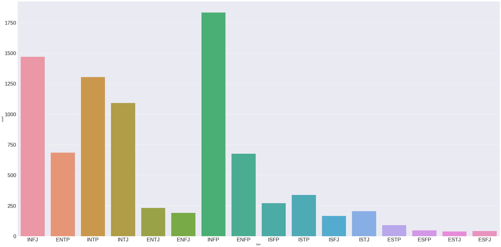
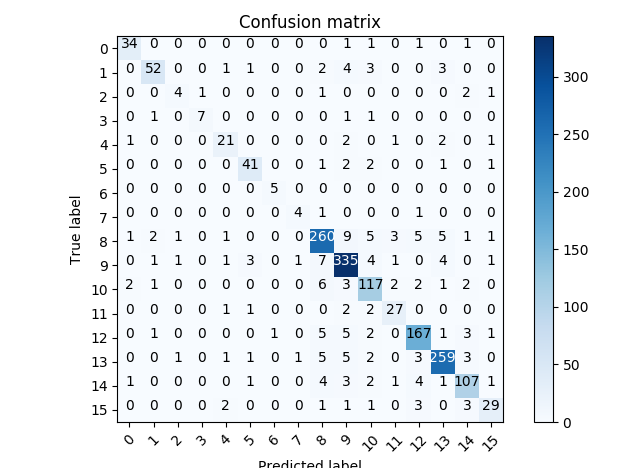

# Convolutional neural network for text documents classification with tensorflow
## Motivations
This project implements a convolutional neural network inspired by those described in the [Convolutional Neural Networks for Sentence Classification](https://arxiv.org/abs/1408.5882) paper by Yoon Kim. This implementation has some advantages over other implementations. 
* The use of generators and a simple parsing systems allows to scale on large data sets with minimal efforts. This implementaton has been tested on this [Amazon review dataset](https://www.kaggle.com/bittlingmayer/amazonreviews) and achieved an accuracy comparable to FastText (+- 91% precision/recall)
* Precision and recall on benchmark datasets such as [STSA binary (Stanford Sentiment Treebank)](https://github.com/taolei87/text_convnet/tree/master/data) and [Sentence Polarity dataset v1](http://www.cs.cornell.edu/people/pabo/movie-review-data/) are higher than 95% on validation data. For the STSA data we measured accuracy/precision/recall on the provided validation set and for Sentence Polarity v1 we performed cross-validation with a random split of 0.9 -0.1 each time. This outperforms the benchmark of 87% accuracy for the STSA dataset.
* Even when training and building a vocabulary on the STSA data, precision and recall are in the order of 85% on the Sentence Polarity v1 validation set, which shows that the model generalizes well on new data.
* We use a simple sentence embedding method. Each stemmed word is mapped to an index and the input sentences are of the form `[1, 5, 59, 23, 0, 0,..., 0]` The zero's are the padding terms so that each vectorized sentence has the same length (size of the longest sentence in the corpus).

## Getting started

This project requires a recent version of tensorflow, and can run fast on CPU for small datasets such as those used as benchmark. For larger datasets such as the Amazon review, running on GPU is desirable.

## Usage

You can train the model on the (MBTI) Myers-Briggs Personality Type Dataset available on [Kaggle](https://www.kaggle.com/datasnaek/mbti-type). The data set is the default dataset and is already present in the ./data directory of the project. This is a multi-label classification problem: the input is composed of sentences written by individuals belonging to the 16 different types of personalities according to the Myers-Briggs standards. The objective is to predict to which type of personality a individual belong. We split the dataset in 80% training data and 20% validation data (the sampling is uniform, each row has the same probability to be choosen as training or validation input). It is important to note that the categories are not balanced. 



[source of the plot](https://www.kaggle.com/depture/multiclass-and-multi-output-classification)

### Training a model from scractch, using the default  (MBTI) Myers-Briggs Personality Type Dataset dataset.

To build a model, just download the project repository and cd to this directory. Run

`python train --help` to see the list of optional arguments you can use. 
                        
  
Train the model with the following command

`python train.py`

Of course you can add any optional argument you want.

Training with the default arguments gives the following results:



### Training a model from scratches, using any labelled text data set

It is possible to train the model on any labelled text dataset using the following procedure. 
* Put your training/validation/prediction data in the appropriate directories ( ./data/train , ./data/test, ./data/predict )
The train and test files should have the exact same format for parsing. Note that if your dataset is contained in many .txt files, you can put for example all your .txt training files in the ./data/train directory without problems.

* you have to write a Parser class in the parser2.py file. This class should be written in a specific way, as explained below.
 ```python
class StsaParser(object):  
 
    def __init__(self):
        
        pass   
        
        
    def transform_label_to_numeric(self, y):
            
            if '1' in y:
                return np.array([1,0])
            else:
                return np.array([0,1])   


    def parse_line(self, row):
        
        row = row.split(' ')
        text = (' '.join(row[1:]))
        label = self.transform_label_to_numeric(row[0])
        return (re.sub(r'\W+', ' ', text), label)   
```
 

* the class must contain a method called `parse_line`, which parses each line of the input documents, as the name implies.
* the `parse_line` method should be named exactly `parse_line`.
* this method must return a tuple. The first element of the tuple is a string containing the document itself (it can be processed in any way you want but it must be a string). The second element of the tuple must be the label of the document, one-hot encoded, as in the example. An example of valid output is 

`"Parrots are interesting", np.array([0,1]) `
* the class can contain any other methods that may be useful to parse the document, as long as the `parse_line` method meets the above criteria.
* make sure to change the Parser object in the train.py file (or predict.py file for predictions)

Example: replace line ... in train.py  `line_parser = StsaParser() ` by  `line_parser = MyCustomParser() ` 

When you are ready, use `python train.py` to start training the model. Make sure to set `--build_voc=True` if you train a model with a dataset different than the STSA for the first time.

## Making predictions

When you model is trained, it will be saved and you will be able to make predictions on any text dataset (just put it on the ./data/predict directory). However, do not forget to use the parser trick explained above if the document you predict has a different format than the documents you trained your model with (change `line_parser = StsaParser() `  by  `line_parser = MyCustomParser() ` is the predict.py file).

To make predictions, just use the following command:

`python predict.py`


## Source

* [Convolutional Neural Networks for Sentence Classification](https://arxiv.org/abs/1408.5882) by Yoon Kim
